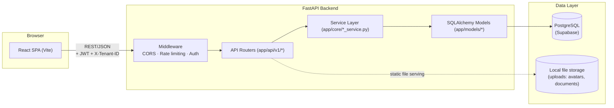
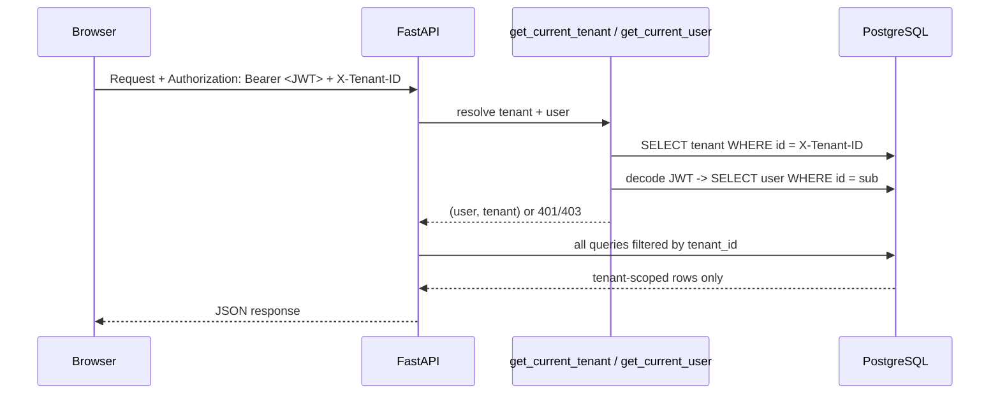
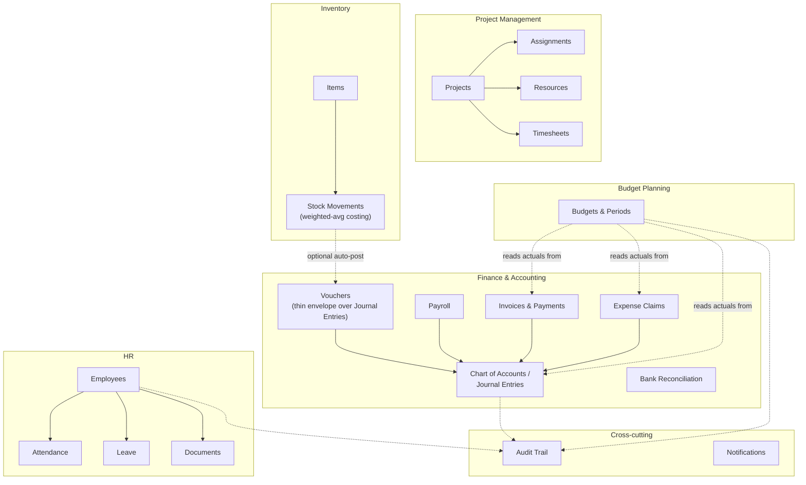

# HRIS → ERP Platform

A multi-tenant Human Resource Information System that is being extended, module by module, into a full ERP platform: HR, Projects, Finance & Accounting, Inventory, and Budget Planning all on one shared backend and design language.

- **Backend:** FastAPI + SQLAlchemy + Alembic, PostgreSQL (Supabase-hosted)
- **Frontend:** React + TypeScript + MUI + TanStack Query, built with Vite
- **Auth:** JWT (access + refresh tokens), role-based access (`admin` / `manager` / `employee`)
- **Multi-tenancy:** every table is scoped by `tenant_id`; every request carries an `X-Tenant-ID` header

---

## Table of Contents

- [Architecture](#architecture)
- [Domain Modules](#domain-modules)
- [Key Design Patterns](#key-design-patterns)
- [Project Structure](#project-structure)
- [Getting Started](#getting-started)
- [Environment Variables](#environment-variables)
- [Database Migrations](#database-migrations)
- [Roadmap](#roadmap)

---

## Architecture

### System overview



**Request flow, thin-router / fat-service:** routers in `app/api/v1/*.py` stay thin — they parse the request, resolve the current user/tenant via dependencies, and delegate business logic to `app/core/*_service.py`. This keeps ledger-posting, costing, and workflow rules in one place per domain instead of scattered across endpoints.

### Multi-tenancy & auth



Every model carries a `tenant_id` foreign key, and every service-layer query filters on it explicitly — there is no implicit global query scope, so a missing filter fails loudly (empty result) rather than silently leaking cross-tenant data.

### Domain module map



Budgets deliberately have **no stored "actual" column** — `app/core/budget_service.py` computes actuals on read from whichever ledger already represents ground truth for that scope (posted journal lines for company/cost-center budgets, invoices for project budgets, expense claims for employee budgets), so there's exactly one source of truth for "what was really spent."

---

## Domain Modules

| Module | Status | Key tables | Notes |
|---|---|---|---|
| HR (Employees, Leave, Attendance, Documents) | ✅ | `employees`, `leaves`, `attendance`, `documents` | Core HRIS functionality |
| Projects (Projects, Assignments, Resources, Timesheets) | ✅ | `projects`, `assignments`, `resources`, `timesheets` | Resource allocation across projects |
| Accounting (Chart of Accounts, Journal Entries, Vouchers, Ledger Groups, Cost Centers, Tax) | ✅ | `accounts`, `journal_entries`, `vouchers`, `ledger_groups`, `cost_centers`, `tax_rates` | Double-entry engine; vouchers are a thin UI/workflow envelope over journal entries |
| Payroll | ✅ | `salary_structures`, `payroll_runs`, `payslips` | Posts to the same ledger as everything else |
| Invoices & Payments | ✅ | `invoices`, `invoice_lines`, `payments` | AR side of accounting |
| Expense Claims | ✅ | `expense_claims`, `expense_claim_lines` | AP side; feeds employee-scoped budgets |
| Bank Reconciliation | ✅ | `bank_reconciliations` | Matches ledger to bank statements |
| Inventory | ✅ | `warehouses`, `items`, `stock_movements`, `suppliers` | Weighted-average costing, optional auto-posting to vouchers |
| Budget Planning | ✅ | `budgets`, `budget_periods` | Company/cost-center/project/employee scopes, actuals computed live, submit→approve/reject workflow |
| Audit Trail | ✅ | `audit_logs` | IP/user-agent/severity, module-based filtering, CSV export |
| Import/Export | 🔜 | — | Planned |
| Business Intelligence | 🔜 | — | Planned |
| Document Center | 🔜 | — | Planned (beyond current per-employee documents) |
| ERP Workflow Engine | 🔜 | — | Planned generalized approval engine |

---

## Key Design Patterns

- **Thin routers, fat services** — `app/api/v1/*.py` only handles HTTP concerns; business rules live in `app/core/*_service.py`.
- **Ledger is the single source of truth** — Inventory and Budgets never duplicate financial state; they read or post through the existing `JournalEntry`/`Voucher` engine.
- **Vouchers as an envelope, not a parallel ledger** — a `Voucher` wraps a `JournalEntry` for UI/workflow purposes (numbering, status, attachments) without introducing a second accounting model.
- **Weighted-average inventory costing** — `StockMovement` rows are append-only and carry a running quantity/average cost computed at write time, so historical costing never needs to be recomputed.
- **Migration safety guard** — `backend/alembic/env.py` refuses to `--autogenerate` if `Base.metadata` doesn't account for every live table (protects against a broken `app/models/__init__.py` import silently producing a mass `DROP TABLE` migration). Run:
  ```bash
  python -c "import app.models; from app.core.database import Base; print(len(Base.metadata.tables))"
  ```
  before trusting any autogenerated migration.
- **Audit logging as a cross-cutting concern** — `record_audit_log()` is called from services (not routers) for every create/update/approve/reject action, capturing actor, IP, user-agent, and severity.

---

## Project Structure

```
hris-system/
├── backend/
│   ├── alembic/
│   │   ├── env.py                 # migration runner + safety guard
│   │   └── versions/              # migration history
│   └── app/
│       ├── api/
│       │   └── v1/                # thin HTTP routers, one file per domain
│       ├── core/                  # service layer, auth, db session, audit
│       │   ├── database.py
│       │   ├── dependencies.py    # get_current_user / get_current_tenant / role guards
│       │   ├── audit.py
│       │   └── *_service.py       # business logic per domain
│       ├── models/                # SQLAlchemy models, one file per domain
│       ├── schemas/                # Pydantic request/response schemas
│       └── main.py                # app assembly, router registration, CORS
└── frontend/
    └── src/
        ├── components/common/     # Sidebar, Navbar, PrivateRoute, shared widgets
        ├── context/                # AuthContext
        ├── pages/                  # one page per route, colocated with feature
        ├── services/api.ts         # one exported *Service object per domain
        └── theme/                  # MUI theme
```

---

## Getting Started

### Prerequisites

- Python 3.11+
- Node.js 18+
- A PostgreSQL database (this project targets Supabase-hosted Postgres, but any Postgres works)

### Backend

```bash
cd backend
python -m venv .venv
./.venv/Scripts/activate        # Windows; use `source .venv/bin/activate` on macOS/Linux
pip install -r requirements.txt

# copy and fill in environment variables (see below)
cp .env.example .env

alembic upgrade head
uvicorn app.main:app --reload --port 8000
```

API docs available at `http://localhost:8000/docs` once running.

### Frontend

```bash
cd frontend
npm install
npm run dev
```

App available at `http://localhost:3000` (or the port Vite reports).

---

## Environment Variables

`backend/.env`:

| Variable | Purpose |
|---|---|
| `DATABASE_URL` | Postgres connection string |
| `SECRET_KEY` | JWT signing key |
| `CORS_ORIGINS` | Comma-separated list of allowed frontend origins |
| `RESEND_API_KEY` | Transactional email (password reset, notifications) |

`frontend/.env`:

| Variable | Purpose |
|---|---|
| `VITE_API_URL` | Base URL of the backend API |

---

## Database Migrations

```bash
cd backend

# generate a migration after changing models
alembic revision --autogenerate -m "describe the change"

# ALWAYS review the generated file before applying —
# the safety guard in alembic/env.py will refuse to run if it detects
# tables in the database that aren't registered on Base.metadata
alembic upgrade head
```

---

## Roadmap

This system is being built out in 10 phases, extending the existing architecture rather than replacing it:

1. ~~Core HRIS (Employees, Leave, Attendance, Projects, Accounting foundation)~~
2. ~~Inventory Management~~
3. ~~Budget Management~~
4. ~~MIS Reports~~
5. ~~Audit Trail~~
6. Import/Export (CSV/Excel)
7. Business Intelligence
8. Document Center
9. ERP Workflow Engine
10. Final integration & polish
