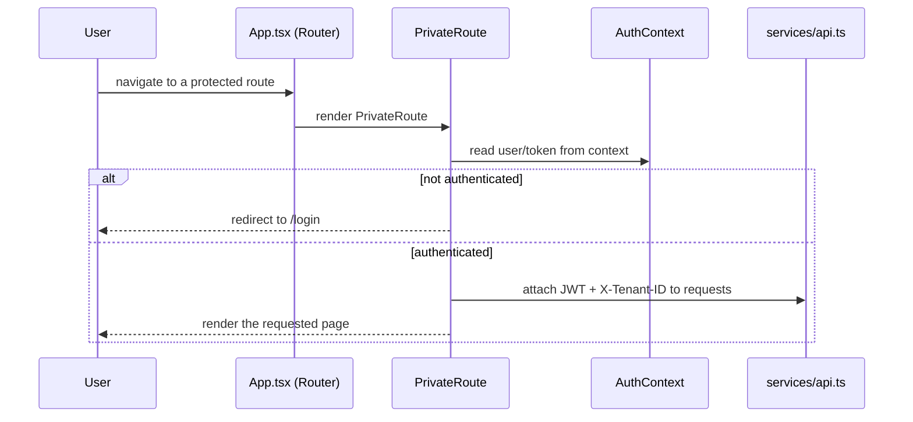
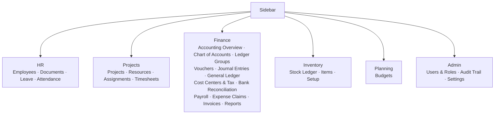

# HRIS / ERP Frontend

React + TypeScript single-page app for the HRIS → ERP platform: HR, Projects, Finance & Accounting, Inventory, and Budget Planning, all sharing one design system and data layer.

This repo contains **only the frontend**. It talks to a separate FastAPI backend over REST — see [Environment Variables](#environment-variables) for how to point it at one.

- **Framework:** React 18 + TypeScript, built with Vite
- **UI:** MUI (Material UI) + Tailwind utility classes + Framer Motion
- **Data fetching:** TanStack Query (React Query) + Axios
- **Routing:** React Router v6
- **Forms/validation:** react-hook-form + Zod

---

## Table of Contents

- [Architecture](#architecture)
- [Project Structure](#project-structure)
- [Getting Started](#getting-started)
- [Environment Variables](#environment-variables)
- [Conventions](#conventions)
- [Available Scripts](#available-scripts)

---

## Architecture

### App shell & data flow


```mermaid
flowchart LR
    subgraph Shell["App Shell"]
        Auth["AuthContext\n(JWT + tenant in memory/localStorage)"]
        Router["React Router\n(PrivateRoute guards)"]
        Layout["Sidebar + Navbar"]
    end

    subgraph Pages["Feature Pages (src/pages)"]
        P1["Employees / Leave / Attendance"]
        P2["Projects / Assignments / Timesheets"]
        P3["Accounting / Vouchers / Payroll / Invoices"]
        P4["Inventory"]
        P5["Budgets"]
    end

    subgraph DataLayer["Data Layer"]
        RQ["TanStack Query\n(cache, refetch, mutations)"]
        API["services/api.ts\n(one *Service object per domain)"]
        Axios["Axios instance\n(base URL + auth/tenant interceptors)"]
    end

    Backend[("FastAPI Backend\n(separate repo/service)")]

    Auth --> Router --> Layout --> Pages
    Pages --> RQ --> API --> Axios --> Backend
```

Every domain (employees, projects, accounting, inventory, budgets, ...) gets **one exported service object** in `src/services/api.ts` (`employeeService`, `budgetService`, `inventoryService`, etc.) that wraps the domain's REST endpoints. Pages never call `axios`/`fetch` directly — they call the service, and TanStack Query owns caching/loading/error state around it.

### Auth & routing guard


```mermaid
sequenceDiagram
    participant User
    participant App as App.tsx (Router)
    participant Guard as PrivateRoute
    participant Ctx as AuthContext
    participant API as services/api.ts

    User->>App: navigate to a protected route
    App->>Guard: render PrivateRoute
    Guard->>Ctx: read user/token from context
    alt not authenticated
        Guard-->>User: redirect to /login
    else authenticated
        Guard->>API: attach JWT + X-Tenant-ID to requests
        Guard-->>User: render the requested page
    end
```

`AuthContext` holds the current user, role (`admin` / `manager` / `employee`), and active tenant. `PrivateRoute` wraps every authenticated route in `App.tsx`; pages further gate specific actions/sections with `isAdmin` / `isManager` checks (see any page's use of `useAuth()`).

### Sidebar → feature module map


```mermaid
flowchart TB
    Sidebar --> HR["HR\nEmployees · Documents · Leave · Attendance"]
    Sidebar --> Proj["Projects\nProjects · Resources · Assignments · Timesheets"]
    Sidebar --> Fin["Finance\nAccounting Overview · Chart of Accounts · Ledger Groups\nVouchers · Journal Entries · General Ledger\nCost Centers & Tax · Bank Reconciliation\nPayroll · Expense Claims · Invoices · Reports"]
    Sidebar --> Inv["Inventory\nStock Ledger · Items · Setup"]
    Sidebar --> Plan["Planning\nBudgets"]
    Sidebar --> Admin["Admin\nUsers & Roles · Audit Trail · Settings"]
```

Each top-level section in `Sidebar.tsx` is gated by role (`isManager`/`isAdmin`) and lazily expands to its sub-pages; the route for each sub-page is registered in `App.tsx`.

---

## Project Structure

```
src/
├── components/
│   └── common/          # Sidebar, Navbar, PrivateRoute, CommandPalette, EmptyState, AccessDenied...
├── context/
│   └── AuthContext.tsx  # current user, role, tenant, login/logout
├── pages/                # one file per route; feature-specific sub-widgets live in a matching subfolder
│   └── vouchers/         # e.g. shared pieces for the Vouchers pages
├── services/
│   └── api.ts            # Axios instance + one exported *Service object per domain
├── theme/
│   └── index.ts          # MUI theme (palette, typography, component overrides)
├── App.tsx                # route table
└── main.tsx               # app entry point
```

**Adding a new page:** create `src/pages/YourFeature.tsx`, add its service functions to `services/api.ts` (or a new export if the domain is new), register the route in `App.tsx`, and add a nav entry in `Sidebar.tsx` gated by the appropriate role.

---

## Getting Started

### Prerequisites

- Node.js 18+
- A running instance of the backend API (see the backend repo) or a URL to a deployed one

### Install & run

```bash
npm install
npm run dev
```

The app runs at `http://localhost:3000` (or whatever port Vite reports) and expects the backend at the URL configured below.

### Build

```bash
npm run build   # type-checks and produces a production build in dist/
npm run preview # serve the production build locally
```

---

## Environment Variables

Create a `.env` file in the project root:

| Variable | Purpose | Default |
|---|---|---|
| `VITE_API_URL` | Base URL of the backend API | `http://localhost:8000/api/v1` |

The active tenant is selected at login time (via the `X-Tenant-ID` header attached by the Axios instance in `services/api.ts`), not via an environment variable.

---

## Conventions

- **MUI styling:** always use the `sx` prop for style overrides (`sx={{ display: 'flex', gap: 1 }}`) rather than bare system props (`display="flex"`) — this project's setup does not reliably apply bare Box/Stack system props as CSS.
- **Icons:** verify an MUI icon name exists before importing it (`ls node_modules/@mui/icons-material/IconName.js`) — guessing icon names is a common source of a completely blank page with no console error.
- **Data fetching:** always go through TanStack Query (`useQuery`/`useMutation`) and a `services/api.ts` function; don't call Axios directly from a component.
- **Role gating:** check `isAdmin`/`isManager` from `useAuth()` both for hiding UI and — defense in depth — expect the backend to enforce the same rule independently.

---

## Available Scripts

| Script | Purpose |
|---|---|
| `npm run dev` | Start the Vite dev server with HMR |
| `npm run build` | Type-check and build for production |
| `npm run preview` | Preview the production build locally |
| `npm run lint` | Run ESLint |
